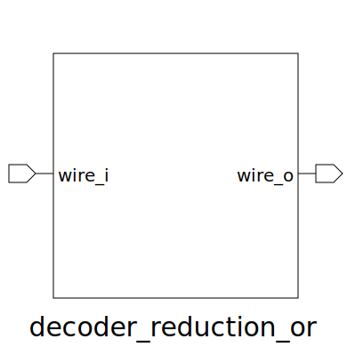

# decoder_reduction_or (module)

### Author : Foez Ahmed (foez.official@gmail.com)

## TOP IO

## Description

Write a markdown documentation for this systemverilog module:

## Parameters
|Name|Type|Dimension|Default Value|Description|
|-|-|-|-|-|
|NUM_INPUTS|int||8||

## Ports
|Name|Direction|Type|Dimension|Description|
|-|-|-|-|-|
|wire_i|input|decoded_instr_t|[NUM_INPUTS]||
|wire_o|output|decoded_instr_t|||
