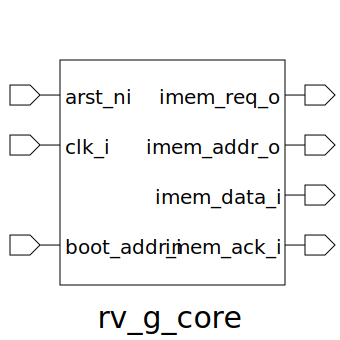

# rv_g_core (module)

### Author : Foez Ahmed (foez.official@gmail.com)

## TOP IO

## Description

Write a markdown documentation for this systemverilog module:

## Parameters
|Name|Type|Dimension|Default Value|Description|
|-|-|-|-|-|
|MEM_ADDR_WIDTH|int||64||
|MEM_DATA_WIDTH|int||64||

## Ports
|Name|Direction|Type|Dimension|Description|
|-|-|-|-|-|
|arst_ni|input|logic|||
|clk_i|input|logic|||
|boot_addr_i|input|logic [MEM_ADDR_WIDTH-1:0]|||
|imem_req_o|output|logic|||
|imem_addr_o|output|logic [MEM_ADDR_WIDTH-1:0]|||
|imem_data_i|output|logic [MEM_DATA_WIDTH-1:0]|||
|imem_ack_i|output|logic [MEM_DATA_WIDTH-1:0]|||
