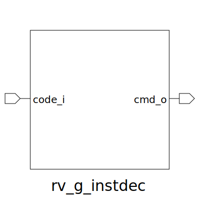

# rv_g_instdec (module)

### Author : Foez Ahmed (foez.official@gmail.com)

## TOP IO

## Description

Write a markdown documentation for this systemverilog module:

## Parameters
|Name|Type|Dimension|Default Value|Description|
|-|-|-|-|-|
|decoded_instr_t|type||rv_g_pkg::decoded_instr_t||

## Ports
|Name|Direction|Type|Dimension|Description|
|-|-|-|-|-|
|code_i|input|logic [31:0]|||
|cmd_o|output|decoded_instr_t|||
