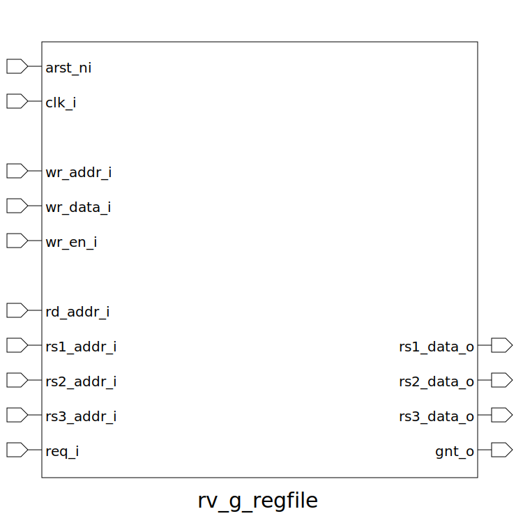

# rv_g_regfile (module)

### Author : Foez Ahmed (foez.official@gmail.com)

## TOP IO

## Description

Write a markdown documentation for this systemverilog module:

## Parameters
|Name|Type|Dimension|Default Value|Description|
|-|-|-|-|-|
|XLEN|int||64|Length of Integer Registers|
|FLEN|int||32|Length of Floating Point Registers|
|MaxLen|int||((FLEN > XLEN) ? FLEN : XLEN)|max(FLEN, XLEN)|
|ALLOW_FORWARDING|bit||1|Allow forwarding write data|

## Ports
|Name|Direction|Type|Dimension|Description|
|-|-|-|-|-|
|arst_ni|input|logic||Asynchronous Global Reset|
|clk_i|input|logic||Synchronous Clock|
|wr_addr_i|input|logic [ 5:0]||Write & Unlock Address|
|wr_data_i|input|logic [MaxLen-1:0]||Write Data|
|wr_en_i|input|logic||Write & Unlock Enable|
|rd_addr_i|input|logic [5:0]||Destination & Lock Address|
|rs1_addr_i|input|logic [5:0]||Source Register 1 Address|
|rs2_addr_i|input|logic [5:0]||Source Register 2 Address|
|rs3_addr_i|input|logic [5:0]||Source Register 3 Address|
|req_i|input|logic||Request Source Register Data & Lock Destination Register|
|rs1_data_o|output|logic [MaxLen-1:0]||Source Register 1 Data|
|rs2_data_o|output|logic [MaxLen-1:0]||Source Register 2 Data|
|rs3_data_o|output|logic [MaxLen-1:0]||Source Register 3 Data|
|gnt_o|output|logic||Grant Access to Source Register Data & Lock Destination Register|
